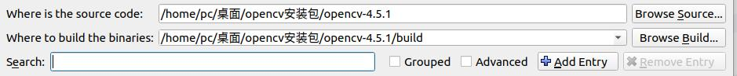
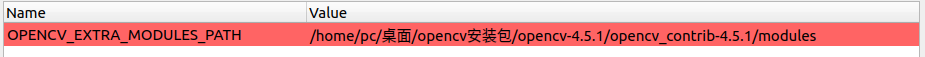

#  夏令营培训2——OpenCV基础学习

##  0. 安装OpenCV

本次夏令营重点进行OpenCV的一些简单学习

推荐安装版本OpenCV 4.5.1，同时安装OpenCV Contrib（注：OpenCV和OpenCV Contrib版本需要一致）

opencv官网：https://opencv.org/


推荐使用Cmake-GUI安装

####   cmake-gui

1. 选择opencv文件夹和新建build文件夹，然后点击configure



2. 

```
修改CMAKE+BUILD_TYPE为RELEASE

修改OPENCV_EXTRA_MODULES_PATH为/..自己的目录../opencv/opencv_contrib/modules,以安装opencv_contrib

勾选OPENCV_GENERATE_PKGCONFIG、OPENCV_ENABLE_NONFREE

再点击configure
```



3. 点击configure和generate，完成cmake配置
4. 进入build文件夹，编译

```
sudo make -j4     #4线程编译
sudo make install #安装
```

##  1. 任务1——Mat

在电脑中随便选择一张图片，使用imread读取该图片，并使用imshow可视化该图片

* **要求**：掌握OpenCV基础Mat类型，使用cmake编译并运行

##  2. 任务2——摄像头和颜色

使用VideoCapture打开一个摄像头

可以是电脑自带摄像头，也可以是usb外接摄像头（如果都没有，请参考**IP摄像头调用手机摄像头.md**）

捕获摄像头图像数据，并将图片色彩空间转换到HSV色彩空间，提取出摄像头图像数据中的红色、蓝色、白色

* **要求**：学会调用摄像头捕获图像，并了解RGB、HSV等色彩空间，基于色彩空间学会颜色提取

##  3. 任务3——形态学操作

学习一些形态学操作，如膨胀、腐蚀、开运算、闭运算等

学习边缘提取（如Canny）和findContours函数，在任务二的基础上，提取出红色、蓝色、白色的轮廓，且利用形态学操作消除一些噪点

* **要求**：学会基础的形态学操作，辅助消除图像噪声等

##  4. 任务4——透视变换

学习掌握透视变换的原理

重点掌握`getPerspectiveTransform`和`warpPerspective`两个函数，拍摄一个物体（如A4纸），并利用透视变换校正视角为正视该物体

* **要求**：学会利用透视变换获取不同的视角

##  5. 任务5——DNN神经网络调用基础

阅读理解DNN神经网络调用的模板，会基于已经训练好的模型文件运行DNN神经网络

* **要求**：学会调用DNN神经网络模板，能切换不同的模型文件运行DNN神经网络进行识别

之后线下进行模型文件训练的教学，也可提前查看**opencv_dnn模块.md**文件自行学习


####  后续带*的任务是附加任务非必需任务，但对进一步理解图像处理有更深的帮助

##  *5. 任务5——查阅学习几个坐标系

自行查阅资料，了解图像坐标系、像素坐标系、相机坐标系、世界坐标系等几个坐标系之间的变换关系

##  *6. 任务6——查阅学习相机原理

深度相机（可以测量距离的相机）大致包含：双目深度相机、结构光相机、TOF相机等，请查阅学习这些相机的测距原理


